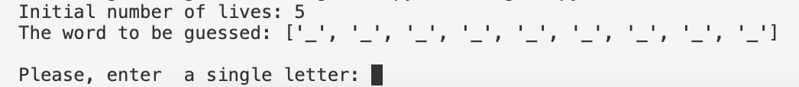

# Hangman 

## About the project 

*Hangman* is a classic game in which a player thinks of a word and the other player tries to guess that word within a certain amount of attempts.

This project is an implementation of the Hangman game, where the computer picks a random word and the user tries to guess it. 

## Rules of the game 

    1. In the beggining of the game a player has 5 lives.
    2. A player guesses a letter: 
        - If letter is correct, it is replaces a dash(-es) on the hidden word.
        - If it doesn't match any of the letters in the hidden word, a player then loses a life.
    4. If a player has no lives left, the game is lost.
    5. If all letters are rewealed before a player loses the lives - game is won. 

## Starting the game
You are able to **start** the game by typing the following commands in the command line:

    $ python hangman.py

## Cloning the game
You are able to **clone** the game by typing the following commands in the command line:

    git clone -c https://github.com/Egle-007/hangman.git

## Other info

### Files in repository

 * hangman.py - to run the game you need to run this file.
 * milestone files are included to show the progress of the project deveplopment.
 * lisence.md
 * README.md 
 * .gitignore and others
### Lisence

    This project is licensed under the MIT lisence.

